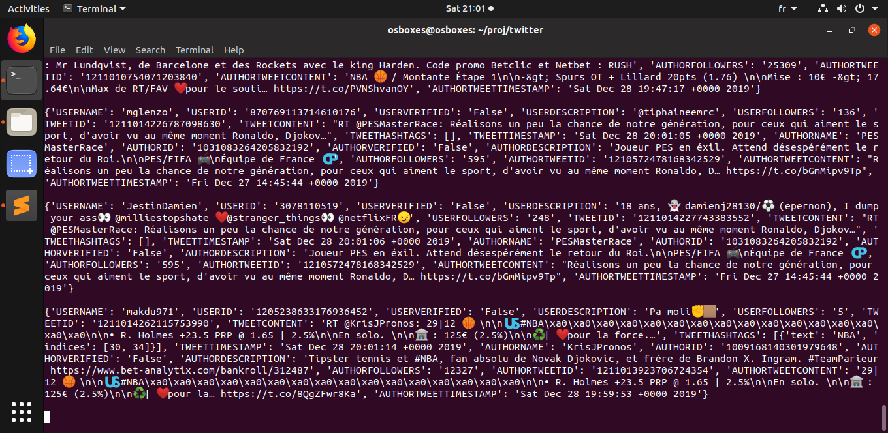

# Twitter Scraper

### En bref
Cette application permet de scrapper Twitter en temps réel via la Twitter Stream API. Une liste Python de mots-clés en entrée permet de filtrer les tweets que l'on souhaite récupérer. Chaque tweet est stocké sous la forme d'un JSON. Les informations disponibles sont diverses et variées : screen name du user, description du user, contenu du tweet, date de création, etc. L'application ne se concentre que sur un nombre restreint d'informations. Afin d'en rajouter, il faut modifier la fonction `ParsingFunction` présente dans le fichier `fun.py`. Pour avoir une vision exhaustive des informations disponibles, se référer à la documentation de la Twitter API Stream ici : https://developer.twitter.com/en/docs/tweets/data-dictionary/overview/tweet-object
<p align="center">
  
</p>


### Cloner l'environnement
Il est nécessaire d'avoir certains packages d'installer pour faire tourner l'application, notamment Tweepy, Pandas et Numpy. Afin de reproduire l'environnement, on utilise Conda : 
```
conda env create -f TwitterScraperEnv.yml
conda activate twitter
```

### Renseigner le login et le password
L'application prend en input un fichier `auth.password` que l'utilisateur doit créer lui-même. La structure de celui-ci est la suivante :
```
consumer_token
consumer_secret
access_token
access_token_secret
```


### Renseigner l'input
Pour renseigner les mots-clés permettant de filtrer les tweets à récupérer, ouvrir le fichier `main.py` et modifier la liste `TrendingTopics`, par exemple : 
```
TrendingTopics = ["nba","playoffs","Lebron"]
```
### Lancer l'application 
Pour lancer l'application : 
```
conda activate twitter
python main.py 1 >> ScrapedTweets 2 >> Errors
```

